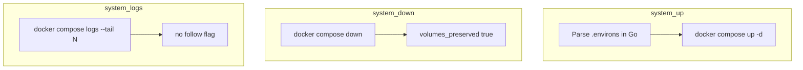
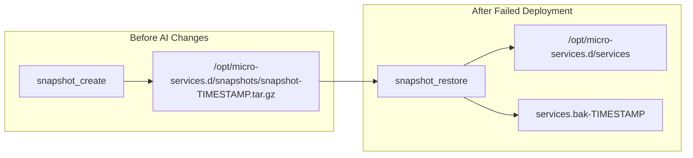
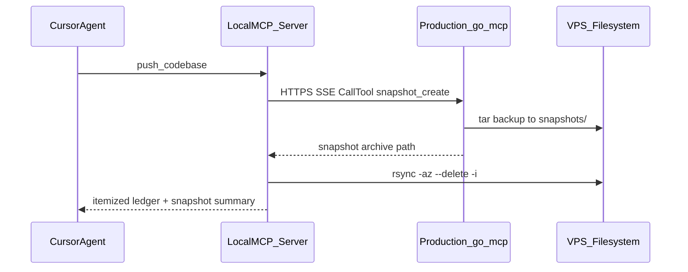

# Architecture Guide — api.thirdeye.live VPS services platform

This document is the definitive onboarding reference for the **services** repository: a Docker-orchestrated micro-services stack that powers the **ThirdEye Quotes API** (`api.thirdeye.live`) and a companion **Model Context Protocol (MCP) server** exposed over HTTPS + Server-Sent Events (SSE). All descriptions below are derived from the repository's source code, Docker/NGINX configuration, and operational scripts.

---

## Table of Contents

1. [System Overview](#1-system-overview)
2. [Micro-Services Breakdown](#2-micro-services-breakdown)
3. [Infrastructure & Network Topology](#3-infrastructure--network-topology)
4. [Data Layer (MongoDB)](#4-data-layer-mongodb)
5. [System Snapshots & Recovery Lifecycle](#5-system-snapshots--recovery-lifecycle)
6. [Runbook — Local Development](#6-runbook--local-development)
7. [Deployment Guide — Production VPS](#7-deployment-guide--production-vps)

---

## 1. System Overview

### What the system does

The platform provides:

- A **quotes REST API** for storing, searching, retrieving, and managing inspirational quotes attributed to authors.
- A **tarot API** for random cards, decks, deck listings, and custom spreads.
- A **Flask web application** that serves an interactive API documentation / demo UI and handles **API token request** workflows (email notification + MongoDB persistence).
- An **MCP server** (`go-mcp`) that exposes LLM-callable tools (health, time, random quote, codebase snapshot/restore, Docker Compose lifecycle up/down, container log inspection, and local→VPS code push) over MCP HTTP+SSE, secured by a shared Bearer token.
- **NGINX** as the TLS-terminating reverse proxy and API gateway routing traffic to the correct upstream by URL path.

### High-level architecture

```
                                    ┌─────────────────────────────────────────┐
                                    │              VPS Host                    │
  Browser / curl                    │                                         │
  MCP clients (Claude, etc.)        │   ┌──────────────┐                      │
        │                           │   │ reverse-proxy│  quotes-proxy        │
        │  HTTPS :443 / HTTP :80    │   │   (NGINX)    │  172.255.255.5       │
        └──────────────────────────►│   └──────┬───────┘                      │
                                    │          │ path-based routing            │
                                    │    ┌─────┼─────────┬────────────┐       │
                                    │    ▼     ▼         ▼            ▼       │
                                    │  web   api      go-mcp        /image    │
                                    │  Flask  Go/Gin   Go/MCP       static    │
                                    │  .4     .3       .6                     │
                                    │    │     │         │                     │
                                    │    └─────┴────┬────┘                     │
                                    │               ▼                          │
                                    │         dbs (MongoDB)                    │
                                    │         172.255.255.2                    │
                                    └─────────────────────────────────────────┘
```

### Component interaction summary

| Layer | Technology | Role |
|-------|------------|------|
| Edge | NGINX (`prx/nginx.conf`) | TLS termination, HTTP→HTTPS redirect, path-based reverse proxy |
| Frontend | Python 3.10 / Flask / Gunicorn | Server-rendered UI, token-request form, AJAX proxy endpoints |
| API | Go 1.19 / Gin | REST API for quotes, auth, admin tokens, tarot |
| MCP | Go 1.25 / stdlib + MCP SDK | Remote MCP tools over `/sse` and `/message` |
| Database | MongoDB 4.4.18 | Persistent storage for quotes, users, token requests, tarot decks |

**Request flow (typical quote read):**

1. Client calls `GET https://api.thirdeye.live/quote`.
2. NGINX matches `location /quote` and proxies to `http://172.255.255.3:8080/quote`.
3. Go API connects to MongoDB at `172.255.255.2:27017`, runs a `$sample` aggregation on the `qdata` collection, returns JSON.

**Request flow (web search):**

1. Browser POSTs to `/search` (via the public API hostname in production JS, or directly to the web container locally).
2. NGINX routes paths matching `search`, `author-quotes`, etc. to the Flask app at `172.255.255.4:5000`.
3. Flask parses form data and calls the Go API internally at `http://172.255.255.3:8080`.

**Request flow (MCP):**

1. MCP client opens `GET /sse` with `Authorization: Bearer <MCP_SECRET_TOKEN>`.
2. NGINX proxies to `go-mcp` at `172.255.255.6:8080` with SSE-specific settings (no buffering, 24h timeouts).
3. Client POSTs JSON-RPC messages to `/message?sessionid=...`; tools such as `quote_random` call the public Quotes API over HTTPS.

---

## 2. Micro-Services Breakdown

### 2.1 `reverse-proxy` — NGINX API Gateway

| Attribute | Value |
|-----------|-------|
| **Container** | `quotes-proxy` |
| **Image** | `nginx:latest` |
| **Static IP** | `172.255.255.5` |
| **Host ports** | `80`, `443` |
| **Config** | `./prx/nginx.conf` mounted at `/etc/nginx/nginx.conf` |

**Responsibilities:**

- Redirect all HTTP (`:80`) traffic to HTTPS.
- Terminate TLS using certificates mounted from the host at `/etc/ssl` (configured paths: `api_thirdeye_live.pem` / `api_thirdeye_live.key`).
- Route requests to upstream services by URL path (see [Section 3](#3-infrastructure--network-topology)).
- Serve static images from `./prx/image` at `/image`.
- Apply MCP-specific protections: per-IP SSE connection limits (`limit_conn mcp_conn 16`), disabled access logging on `/sse` and `/message` to avoid leaking tokens.

**Startup dependency:** Waits for `web` and `api` to start, and for `go-mcp` to become **healthy** (healthcheck on `/healthz`).

---

### 2.2 `web` — Flask Frontend (`quotes-frontend`)

| Attribute | Value |
|-----------|-------|
| **Container** | `quotes-frontend` |
| **Image** | `quotes-frontend:latest` (built from `./web`) |
| **Static IP** | `172.255.255.4` |
| **Internal port** | `5000` (also published to host `5000:5000`) |
| **Process** | Gunicorn, 4 workers, binding `0.0.0.0:5000` |

**Technology stack:**

- Python 3.10 (`python:3.10-slim-bookworm` base image — moved off EOL Buster, Audit P-3)
- Flask 2.2.2, Flask-CORS, Flask-WTF, Flask-ReCaptcha
- pymongo 4.3.3, requests 2.28.1
- dkimpy (DKIM email signing)
- Frontend: Jinja2 templates, Bootstrap 5.2.3 (CDN), jQuery 3.6.1, vanilla JS

**Primary responsibilities:**

1. **Home / API demo UI** (`/`, `/home`) — displays a random quote and an accordion-style interactive API explorer.
2. **AJAX endpoints** proxied through Flask:
   - `POST /search` — keyword/phrase search (calls Go API `POST /quote/search`)
   - `POST /author-quotes` — quotes by author name (calls Go API `GET /authors/{name}`)
3. **Token request workflow** — users submit email + reCAPTCHA; Flask checks duplicate via Go admin API, sends admin notification email, stores pending request.

**Communication:**

| Target | Address | Purpose |
|--------|---------|---------|
| Go API | `http://172.255.255.3:8080` | All quote/admin operations (`web/main/endpoints.py`) |
| MongoDB | `172.255.255.2:27017` | Direct access in `dataops.py` (module exists but is **not imported** by active routes — token flow uses the Go API instead) |
| SMTP | `thepromethean.net:465` | Outbound mail via `web/main/mail.py` |
| Public API (browser JS) | `https://api.thirdeye.live/*` | Client-side AJAX in `web/static/js/main.js` hits production URLs directly |

**Environment variables:**

| Variable | Used for |
|----------|----------|
| `MAILSERVER` | SMTP login username |
| `MAILPASS` | SMTP password |
| `AUTHORIZED` | Bearer token sent as `Authorization` header when calling Go admin token endpoints |
| `MONGO_INITDB_ROOT_USERNAME` | Mongo credentials (passed through; primary DB access in routes uses Go API) |
| `MONGO_INITDB_ROOT_PASSWORD` | Mongo credentials |

**Key source files:**

```
web/
├── Dockerfile
├── flask_recaptcha.py          # Vendored into site-packages at build time
├── dkim/                       # DKIM keys for thirdeye.live outbound mail
└── quotes-web/
    ├── wsgi.py                 # Gunicorn entrypoint
    └── web/
        ├── __init__.py         # Flask app factory
        ├── main/
        │   ├── routes.py       # Blueprint routes
        │   ├── operations.py   # HTTP calls to Go API
        │   ├── endpoints.py    # Internal API URL definitions
        │   ├── notifications.py
        │   ├── mail.py
        │   └── forms.py
        ├── templates/          # Jinja2 HTML
        └── static/js/main.js   # jQuery AJAX demo handlers
```

---

### 2.3 `api` — Go Quotes REST API (`quotes-server`)

| Attribute | Value |
|-----------|-------|
| **Container** | `quotes-server` |
| **Image** | `quotes-server:latest` (built from `./api`) |
| **Static IP** | `172.255.255.3` |
| **Internal port** | `8080` (published to host `8080:8080`) |
| **Module** | `kafka.local/quotes-api` |

**Technology stack:**

- Go 1.19
- [Gin](https://github.com/gin-gonic/gin) v1.8.1 — HTTP router
- [mongo-go-driver](https://go.mongodb.org/mongo-driver) v1.10.2

**Primary responsibilities:**

| Domain | Endpoints | Auth |
|--------|-----------|------|
| Quotes (read) | `GET /quote`, `GET /quote/:id`, `GET /authors`, `GET /authors/:name`, `POST /quote/search` | Public |
| Quotes (write) | `POST /quote`, `PUT /quote/:id`, `DELETE /quote/:id` | `Authorization` header → lookup in `users` collection |
| Admin tokens | `GET/POST/PUT/DELETE /admin/tokens`, `GET /admin/tokens/:email` | Auth middleware + `ADMIN_ID` match |
| Tarot | `GET /tarot/card`, `/tarot/deck`, `/tarot/deck/:id`, `/tarot/decks`, `POST /tarot/spread` | Public |

**MongoDB connection** (from `api/src/main.go`):

```
mongodb://<MONGO_INITDB_ROOT_USERNAME>:<MONGO_INITDB_ROOT_PASSWORD>@172.255.255.2:27017/test?authSource=admin
```

**Collections used:**

| Database | Collection | Handler |
|----------|------------|---------|
| `$MONGO_DATABASE` (e.g. `qdb`) | `qdata` | QuoteHandler |
| `$MONGO_DATABASE` | `users` | AuthoHandler |
| `$MONGO_DATABASE` | `tokens` | TokenHandler |
| `tarotdb` | `tdata` | TarotHandler |

**Authentication model:**

1. `AuthMiddleware` reads the raw `Authorization` header value.
2. Looks up a document in `users` where `authorization` field matches the header.
3. On success, sets Gin context key `uid` to the user's `uid`.
4. `AdminAuthMiddleware` additionally requires `uid == ADMIN_ID`.

**Environment variables:**

| Variable | Purpose |
|----------|---------|
| `MONGO_INITDB_ROOT_USERNAME` | MongoDB root user |
| `MONGO_INITDB_ROOT_PASSWORD` | MongoDB root password |
| `MONGO_DATABASE` | Target database name (e.g. `qdb`) |
| `ADMIN_ID` | UID string identifying the admin user |

**Key source layout:**

```
api/
├── Dockerfile
└── src/
    ├── main.go              # Router wiring, Mongo init
    ├── handlers/
    │   ├── auth.go
    │   ├── quotes.go
    │   ├── token.go
    │   └── tarot.go
    ├── models/              # BSON/JSON structs
    ├── dbs/operations.go    # Tag generation, regex helpers
    └── utils/utils.go
```

---

### 2.4 `dbs` — MongoDB

| Attribute | Value |
|-----------|-------|
| **Container** | `quotes-database` |
| **Image** | `mongo:4.4.18` |
| **Static IP** | `172.255.255.2` |
| **Host port** | `27017:27017` |
| **Volume** | External named volume `quotes-api` → `/data/db` |

**Responsibilities:** Persistent document storage for all application data. Initialized with root credentials from `MONGO_INITDB_ROOT_USERNAME` / `MONGO_INITDB_ROOT_PASSWORD`.

Seed/export JSON files exist under `dbs/quotes/collections/` for reference and manual import (`qdata.json`, `users.json`, `tokens.json`). There is **no automated init script** in the repository that loads these on container start.

---

### 2.5 `go-mcp` — Custom-VPS-MCP-Engine

| Attribute | Value |
|-----------|-------|
| **Container** | `go-mcp` |
| **Image** | `go-mcp:latest` (built from `./mcp-server`) |
| **Static IP** | `172.255.255.6` |
| **Internal port** | `8080` (**not** published to host) |
| **Module** | `mcp-server` |

**Technology stack:**

- Go 1.25.0
- Standard library HTTP server + routing
- [`github.com/modelcontextprotocol/go-sdk`](https://github.com/modelcontextprotocol/go-sdk) v1.6.1 (sole direct dependency)
- Multi-stage Alpine Docker build, non-root runtime user

**Primary responsibilities:**

Expose MCP tools to LLM clients over HTTP + SSE:

| Tool | Description |
|------|-------------|
| `system_health` | Process uptime, Go version, goroutine count, UTC time |
| `system_time` | Current time with optional IANA timezone |
| `quote_random` | Fetches a random quote from `https://api.thirdeye.live/quote` |
| `snapshot_create` | Archives `/opt/micro-services.d/services` to `/opt/micro-services.d/snapshots/snapshot-YYYY-MM-DD_HH-MM-SS.tar.gz`, excluding `image` and `vol` |
| `snapshot_restore` | Restores a named archive from `/opt/micro-services.d/snapshots/` into `/opt/micro-services.d/services` with failsafe backup rename and rollback |
| `system_down` | Runs `docker compose down` in `/opt/micro-services.d/services` — **never removes volumes** (MongoDB data preserved) |
| `system_up` | Runs `docker compose up -d` (optional `--build`), loading env from `.environs` |
| `system_logs` | Static `docker compose logs --tail N` snapshot (no follow); optional service filter |
| `push_codebase` | **Local MCP only:** pre-flight remote `snapshot_create`, then rsync local repo to `/opt/micro-services.d/services/` with itemized deploy ledger |
| `db_collections` | Allowlisted MongoDB namespaces (`qdata`, `users`, `tokens`, `tdata`) with estimated counts and the skill's limits |
| `db_find` | Bounded native find (Extended JSON filter/projection/sort; hard cap 50 docs, 48 KiB budget, token redaction) |
| `db_count` | Native countDocuments; first half of the destructive-write handshake |
| `db_aggregate` | Bounded read-only aggregation (`$out`/`$merge`/`$where` banned; joins allowlist-checked; terminal `$limit` always appended) |
| `user_list` | Bounded, redacted API-user listing (replaces `list_users.sh`) |
| `quote_owner_lookup` | Quote ObjectId → owner uid (replaces `find_user_by_post_id.sh`) |
| `db_insert` † | Ordered insert, max 25 docs/call |
| `db_update` † | Single-doc default; `many=true` requires a `db_count` handshake; empty filters rejected |
| `db_delete` † | Single-doc default; `many=true` requires a `db_count` handshake; empty `{}` filter always rejected |
| `user_provision` † | Atomic API-user creation with crypto-random uid/token (replaces `add_user.sh`) |
| `user_revoke` † | Single-user removal by email (replaces `remove_user.sh`) |

† Write tools — registered **only** when `MCP_DB_ALLOW_WRITES=true` (fail-closed; the stack ships read-only).

**Routes:**

| Path | Method | Auth | Purpose |
|------|--------|------|---------|
| `/healthz` | GET | **None** | Container liveness probe (internal only; not proxied by NGINX) |
| `/sse` | GET | Bearer token | MCP SSE event stream |
| `/message` | POST | Bearer token | MCP JSON-RPC message channel |

**Authentication:** `MCP_SECRET_TOKEN` env var; middleware fails closed (HTTP 500 if unset, HTTP 401 if token missing/invalid). Supports `Authorization: Bearer <token>` or `?token=` query fallback.

**Environment variables:**

| Variable | Default | Required |
|----------|---------|----------|
| `MCP_SECRET_TOKEN` | — | **Yes** |
| `PORT` | `8080` | No |

**Resource limits** (compose `deploy.resources`): 0.50 CPU, 256M memory.

**Host bind mounts and Docker access** (snapshot + lifecycle tools):

| Host path | Container path | Mode | Purpose |
|-----------|----------------|------|---------|
| `/opt/micro-services.d/services` | `/opt/micro-services.d/services` | read-write | Compose project, `.environs`, codebase |
| `/opt/micro-services.d/snapshots` | `/opt/micro-services.d/snapshots` | read-write | Snapshot archives |
| `/var/run/docker.sock` | `/var/run/docker.sock` | read-write | Docker Engine API for compose commands |

The container joins the host `docker` group via `group_add` (`DOCKER_GID`) so the non-root `mcp` user can access the socket. Both filesystem paths must be writable by `mcp`. See [`mcp-server/README.md`](mcp-server/README.md) Section 8.2 for setup commands.

**Detailed MCP documentation:** see [`mcp-server/README.md`](mcp-server/README.md) and [`mcp-server/client-connection-guide.md`](mcp-server/client-connection-guide.md).

> **Note:** `mcp-server/` contains its own `.git` directory (nested repository). The composite root `docker-compose.yml` builds it as a sibling service.

---

## 3. Infrastructure & Network Topology

### Docker Compose orchestration

The root [`docker-compose.yml`](docker-compose.yml) defines five services on a custom bridge network. It is a **composite** descriptor that extends the original quotes stack (preserved in `mcp-server/vps-docs/docker-compose.yml`) with the `go-mcp` service.

### Network: `quotes`

| Property | Value |
|----------|-------|
| Driver | bridge |
| Subnet | `172.255.255.0/24` |
| IPAM | default |

### Static IP assignments

| Service | Container name | IP address | Host port mapping |
|---------|----------------|------------|-------------------|
| `dbs` | `quotes-database` | `172.255.255.2` | `27017:27017` |
| `api` | `quotes-server` | `172.255.255.3` | `8080:8080` |
| `web` | `quotes-frontend` | `172.255.255.4` | `5000:5000` |
| `reverse-proxy` | `quotes-proxy` | `172.255.255.5` | `80:80`, `443:443` |
| `go-mcp` | `go-mcp` | `172.255.255.6` | *(none — internal only)* |

All inter-service communication uses these static IPs (hard-coded in application source, not Docker DNS service names).

### Volume management

| Volume | Type | Mount | Purpose |
|--------|------|-------|---------|
| `quotes-api` | **External** (must pre-exist) | `dbs:/data/db` | MongoDB persistent data |
| `/etc/ssl` (host) | bind, read-only | `reverse-proxy`, `web`, `api` | TLS certificates |
| `./prx/nginx.conf` | bind | `reverse-proxy` | NGINX configuration |
| `./prx/image` | bind, read-only | `reverse-proxy` | Static image assets |

Create the external volume before first deploy:

```bash
docker volume create quotes-api
```

### NGINX routing table

All routes are on the `:443` SSL server block. HTTP `:80` unconditionally redirects to HTTPS.

| Location pattern | Upstream | Notes |
|------------------|----------|-------|
| `/` | `172.255.255.4:5000` | Flask home / UI |
| `^/(quotes\|all-authors\|search\|get-quote\|post-quote\|update-quote\|delete-quote\|author-quotes)` | `172.255.255.4:5000` | Flask AJAX endpoints |
| `/image` | local alias `/usr/share/nginx/html/image/` | Static files |
| `/quote` | `172.255.255.3:8080/quote` | Go API |
| `/quote/search` | `172.255.255.3:8080/quote/search` | Go API |
| `/authors` | `172.255.255.3:8080/authors` | Go API |
| `/admin/tokens` | `172.255.255.3:8080/admin/tokens` | Go API (admin) |
| `/tarot/card` | `172.255.255.3:8080/tarot/card` | Go API |
| `/tarot/deck` | `172.255.255.3:8080/tarot/deck` | Go API |
| `/tarot/decks` | `172.255.255.3:8080/tarot/decks` | Go API |
| `/tarot/spread` | `172.255.255.3:8080/tarot/spread` | Go API |
| `/sse` | `172.255.255.6:8080` | MCP SSE (special proxy settings) |
| `/message` | `172.255.255.6:8080` | MCP messages (special proxy settings) |

**MCP-specific NGINX directives** (do not reuse generic proxy settings for these):

- `proxy_http_version 1.1` + `Connection ""` — persistent HTTP/1.1 for SSE
- `proxy_buffering off`, `proxy_cache off` — immediate event delivery
- `proxy_read_timeout 24h`, `proxy_send_timeout 24h` — long-lived streams
- `proxy_set_header Authorization $http_authorization` — forward Bearer token
- `access_log off` on `/sse` and `/message` — prevent token leakage in logs
- `limit_conn mcp_conn 16` on `/sse` — cap concurrent SSE streams per client IP

### Service dependency graph

```
dbs
 └── api
      └── web
           └── reverse-proxy ◄── go-mcp (must be healthy)
```

### MCP Docker lifecycle management

The `go-mcp` service exposes three MCP tools (implemented in [`mcp-server/internal/skills/docker/`](mcp-server/internal/skills/docker/)) that run `docker compose` against `/opt/micro-services.d/services` via the mounted Docker socket.



#### `system_down` — safe shutdown (volumes preserved)

| Property | Value |
|----------|-------|
| Command | **`docker compose down` only** — no `-v`, no `--volumes` |
| Effect | Stops and removes containers and project-defined networks |
| **Preserved** | External/named volumes including **`quotes-api`** (MongoDB `/data/db`), bind mounts, and all persistent database data |

The Go implementation includes an explicit code comment forbidding volume-removal flags. This is a non-negotiable safeguard: bringing the stack down must never delete MongoDB or other durable state.

**Warning:** `go-mcp` is part of the stack — after `system_down`, MCP is unreachable until manual `docker compose up -d` on the host.

**Partial-teardown caveat:** the compose client for `system_down` runs *inside* the `go-mcp` container. When Docker stops `go-mcp` (early in the shutdown sequence — only `reverse-proxy` depends on it), the orchestrating client process dies with it. Consequences operators must expect:

1. The teardown may complete only **partially** — some services (`web`, `api`, `dbs`) and the project network may still be up.
2. The tool's success report may **never be delivered** to the MCP client (the SSE stream is severed when the container stops).

Always verify and finish the shutdown on the VPS host: `docker compose ps`, then `docker compose down` (still without `-v`), and bring the stack back with `docker compose up -d`.

#### `system_up` — start stack

| Property | Value |
|----------|-------|
| Command | `docker compose up -d` or `docker compose up -d --build` |
| Environment | Variables loaded by parsing `/opt/micro-services.d/services/.environs` in Go (injected into `cmd.Env`) |
| Argument | `build` (boolean, optional) — when true, adds `--build` |

#### `system_logs` — static troubleshooting snapshot

| Property | Value |
|----------|-------|
| Command | `docker compose logs --tail <N>` or `docker compose logs --tail <N> <service>` |
| Default tail | 100 lines |
| Service filter | Optional; valid keys: `reverse-proxy`, `web`, `api`, `dbs`, `go-mcp` |
| **Forbidden** | `-f` / `--follow` — never implemented; prevents blocking MCP handlers |

Output is capped (~256 KiB) to protect the memory-limited `go-mcp` container.

#### Typical AI agent workflow

1. **`snapshot_create`** — backup codebase before changes.
2. Apply changes (or deploy).
3. On failure: **`snapshot_restore`** with the pre-change archive, then **`system_up`** with `build: true`.
4. For debugging: **`system_logs`** with `service: "api"` and `tail: 200`.
5. Maintenance window: **`system_down`** (database volumes remain intact), perform host-level work, then bring the stack back with **`docker compose up -d` on the host** — `system_up` cannot be called while MCP itself is down (see the partial-teardown caveat above).

### MCP database skill (native MongoDB tools)

Implemented in [`mcp-server/internal/skills/database/`](mcp-server/internal/skills/database/) on the official Go driver v2 — **no shell, no `mongo --eval`, no JavaScript**, which retires the Audit C-8 eval-injection class entirely.

**Connection (credential precedence):**

1. `MCP_MONGO_URI` — full connection-string override.
2. `MCP_MONGO_USERNAME` + `MCP_MONGO_PASSWORD` — **preferred**: the scoped `mcp_agent` user.
3. `MONGO_INITDB_ROOT_USERNAME` + `MONGO_INITDB_ROOT_PASSWORD` — fallback (mirrors the api service); logs a WARNING about running as root.

Default address `172.255.255.2:27017`, `authSource=admin`, majority write concern, lazy connect on first tool call (MCP boots fine with Mongo down; a failed connect retries on the next call).

**One-time runbook — create the least-privilege `mcp_agent` user (approved decision #2):**

```bash
# On the VPS host (generate a strong password first; add it to .env as MCP_MONGO_PASSWORD)
docker exec quotes-database mongo admin \
  -u "$MONGO_INITDB_ROOT_USERNAME" -p "$MONGO_INITDB_ROOT_PASSWORD" \
  --authenticationDatabase admin --eval "
    db.createUser({
      user: 'mcp_agent',
      pwd: '$MCP_MONGO_PASSWORD',
      roles: [
        { role: 'readWrite', db: 'qdb' },
        { role: 'readWrite', db: 'tarotdb' }
      ]
    });
  "

# Recommended alongside it: a unique index on users.email, which makes
# user_provision fully atomic under concurrency.
docker exec quotes-database mongo qdb \
  -u "$MONGO_INITDB_ROOT_USERNAME" -p "$MONGO_INITDB_ROOT_PASSWORD" \
  --authenticationDatabase admin --eval '
    db.users.createIndex({ email: 1 }, { unique: true });
  '

# Then in .env next to docker-compose.yml:
#   MCP_MONGO_USERNAME=mcp_agent
#   MCP_MONGO_PASSWORD=<the generated password>
#   MCP_DB_ALLOW_WRITES=true        # only when write tools are wanted
docker compose up -d go-mcp
```

**Guardrail contract (enforced in Go, tested in `guardrails_test.go`):**

| Guardrail | Enforcement |
|-----------|-------------|
| Namespace allowlist | Only `qdb.qdata`, `qdb.users`, `qdb.tokens`, `tarotdb.tdata` are reachable — even with root credentials |
| Result bounding | Hard cap 50 docs (default 20), 48 KiB response budget, skip ≤ 10 000, 10s server-side time box |
| Empty-filter wipe guard | `db_update`/`db_delete` reject `{}` with **no bypass flag** |
| Many-write handshake | `many=true` requires `expected_matches` from `db_count`; server re-counts and aborts on mismatch; absolute ceiling 100 docs |
| Operator bans | `$where`/`$function`/`$accumulator` everywhere; `$out`/`$merge` in pipelines; join targets allowlist + same-database checked |
| Secret redaction | `authorization` fields masked to `[REDACTED sha256:…]` in all output unless `include_secrets`/`include_tokens` is passed; `user_provision` returns the token exactly once |
| Read-only default | Write tools not even advertised unless `MCP_DB_ALLOW_WRITES=true` |
| Audit trail | Every write logs tool, namespace, filter digest (never the raw filter), and affected counts |

---

## 4. Data Layer (MongoDB)

### Database architecture

The Go API connects to **two logical databases** on a single MongoDB instance:

| Database | Collection | Purpose |
|----------|------------|---------|
| `qdb` (via `MONGO_DATABASE`) | `qdata` | Quote documents |
| `qdb` | `users` | API users and authorization tokens |
| `qdb` | `tokens` | Pending API token requests from the web form |
| `tarotdb` | `tdata` | Tarot deck documents |

### Schema designs

#### `qdb.qdata` — Quotes

```json
{
  "_id": ObjectId,
  "quote": "string",
  "attribution": "string",
  "ueid": "string",
  "uid": "string"
}
```

| Field | Description |
|-------|-------------|
| `quote` | Quote text |
| `attribution` | Author name |
| `ueid` | Unique entity ID — generated from author surname + quote text (`dbs.CreateTag`) to prevent duplicates |
| `uid` | UID of the user who created the quote |

#### `qdb.users` — API Users

```json
{
  "_id": ObjectId,
  "uid": "string",
  "email": "string",
  "authorization": "string"
}
```

The `authorization` field stores the raw value clients send in the `Authorization` HTTP header.

#### `qdb.tokens` — Token Requests

```json
{
  "_id": ObjectId,
  "email": "string",
  "granted": "string"
}
```

`granted` is stored as a string (e.g. `"false"`), not a boolean.

#### `tarotdb.tdata` — Tarot Decks

```json
{
  "_id": ObjectId,
  "name": "string",
  "deck": "number",
  "cards": ["string", ...]
}
```

Tarot handlers query by numeric `deck` field (random range `1–69`) or by `name`.

### Indexing strategies

**Evidence from code:**

| Index (inferred) | Collection | Evidence |
|------------------|------------|----------|
| **Text index** on `quote` (and likely `attribution`) | `qdata` | `SearchQuotesHandler` uses `$text` / `$search` queries |
| **Unique index** on `ueid` | `qdata` | `AddQuoteHandler` catches `mongo.IsDuplicateKeyError` on insert |
| **Unique index** on `email` | `tokens` | `EmailExists` handler catches duplicate key on insert |
| **Index on `authorization`** (likely) | `users` | `AuthMiddleware` queries `{authorization: key}` on every authenticated request |

> **Important:** No index-creation scripts, migrations, or MongoDB init hooks exist in this repository. Indexes must be created manually (or restored from a production `mongodump`) before search and duplicate-prevention features work correctly. Example text index:

```javascript
db.qdata.createIndex({ quote: "text", attribution: "text" })
db.qdata.createIndex({ ueid: 1 }, { unique: true })
db.tokens.createIndex({ email: 1 }, { unique: true })
```

### Data flow between services

```
┌─────────────┐   HTTP (internal)    ┌─────────────┐   MongoDB wire protocol   ┌──────────┐
│  web Flask  │ ──────────────────► │  api (Go)   │ ────────────────────────► │   dbs    │
└─────────────┘                      └─────────────┘                           └──────────┘
       │                                    ▲                                        ▲
       │ SMTP (token notification)          │                                        │
       ▼                                    │                                        │
  Mail server                          ┌─────┴──────┐                                 │
                                       │  go-mcp    │ ── HTTPS ──► api.thirdeye.live  │
                                       │  (MCP)     │    (quote_random tool)           │
                                       └────────────┘                                 │
                                                                                      │
                                              All services read/write ────────────────┘
                                              via 172.255.255.2:27017
```

1. **Quote reads/writes:** Browser or API client → NGINX → Go API → MongoDB.
2. **Search (via web):** Browser → NGINX → Flask `/search` → Go API `POST /quote/search` → MongoDB `$text` query.
3. **Token requests:** Browser form → Flask → Go API `GET /admin/tokens/:email` (with `AUTHORIZED` header) → inserts into `tokens` → Flask sends admin email.
4. **User provisioning:** Operator runs `scripts/add_user.sh` → `docker exec` into MongoDB → inserts into `users`.
5. **MCP tools:** MCP client → NGINX → go-mcp → tool handlers (quotes API, snapshot tar, docker compose lifecycle).

### Seed data

JSON exports in `dbs/quotes/collections/` can be imported manually:

```bash
mongoimport --host 172.255.255.2 --db qdb --collection qdata \
  --file dbs/quotes/collections/qdata.json --jsonArray \
  -u "$MONGO_INITDB_ROOT_USERNAME" -p "$MONGO_INITDB_ROOT_PASSWORD" --authenticationDatabase admin
```

The `qdata.json` file contains thousands of quote documents and is several megabytes in size.

---

## 5. System Snapshots & Recovery Lifecycle

The MCP server exposes a paired backup/restore workflow for the VPS codebase at `/opt/micro-services.d/services`. Both tools run inside the `go-mcp` container against host bind mounts and require Bearer authentication like all MCP endpoints.

### Overview



| Path | Purpose |
|------|---------|
| `/opt/micro-services.d/services` | Active codebase (Docker stack, API, web, configs) |
| `/opt/micro-services.d/snapshots/` | Timestamped `.tar.gz` archives |
| `/opt/micro-services.d/services.bak-<timestamp>` | Previous active tree after a restore (not removed automatically) |

### `snapshot_create`

**When to use:** Immediately before any major AI-driven edit, dependency upgrade, or risky deployment.

**What it does:**

1. Validates `/opt/micro-services.d/services` exists.
2. Creates `/opt/micro-services.d/snapshots/` if needed.
3. Runs `tar -czf … --exclude=image --exclude=vol -C /opt/micro-services.d/services .`
4. Writes `snapshot-YYYY-MM-DD_HH-MM-SS.tar.gz`.

**MCP invocation:** Call tool `snapshot_create` with **no arguments**.

**Example MCP JSON-RPC:**

```json
{"jsonrpc":"2.0","id":1,"method":"tools/call","params":{"name":"snapshot_create","arguments":{}}}
```

**Success output fields:** `status`, `archive`, `source`, `excluded`, `created_at_utc`.

### `snapshot_restore`

**When to use:** When a deployment or AI-applied change breaks the stack and you need to revert to a known-good archive.

**What it does:**

1. Validates the `filename` argument (basename only; must match `snapshot-*.tar.gz`).
2. Confirms the archive exists in `/opt/micro-services.d/snapshots/`.
3. Renames the active directory: `services` → `services.bak-<timestamp>`.
4. Creates a fresh `services` directory.
5. Runs `tar -xzf <archive> -C /opt/micro-services.d/services`.
6. **On extraction failure:** removes the partial `services` directory and renames `services.bak-<timestamp>` back to `services` (automatic rollback).

**MCP invocation:** Call tool `snapshot_restore` with the archive **basename**:

```json
{
  "jsonrpc": "2.0",
  "id": 2,
  "method": "tools/call",
  "params": {
    "name": "snapshot_restore",
    "arguments": {
      "filename": "snapshot-2026-07-12_12-00-00.tar.gz"
    }
  }
}
```

**Success output fields:** `status`, `restored_from`, `services_dir`, `previous_services_backup`, `restored_at_utc`.

### Step-by-step workflow for developers and AI agents

#### A. Before major changes (backup)

1. Connect to the MCP server (`GET /sse`, then `POST /message` with Bearer token).
2. Call `snapshot_create` with empty arguments.
3. Note the `archive` path from the tool response (e.g. `/opt/micro-services.d/snapshots/snapshot-2026-07-12_12-00-00.tar.gz`).
4. Optionally verify on the VPS host:
   ```bash
   ls -lh /opt/micro-services.d/snapshots/
   ```
5. Proceed with AI-driven edits or deployment.

#### B. After a failed deployment (restore)

1. List available snapshots on the VPS:
   ```bash
   ls -1 /opt/micro-services.d/snapshots/snapshot-*.tar.gz
   ```
2. Choose the archive created **before** the failed change.
3. Call `snapshot_restore` with `filename` set to that archive's basename only.
4. Confirm the tool response shows `status: ok` and note `previous_services_backup` (the failed tree is preserved as `services.bak-<timestamp>`).
5. Rebuild/restart affected containers if needed:
   ```bash
   cd /opt/micro-services.d/services   # or your compose deploy path
   docker compose up -d --build
   ```
6. Verify services (API, web, MCP) before deleting old `services.bak-*` directories manually.

### Important notes

- Archives **exclude** `image/` and `vol/` to save space; those directories are **not** restored from snapshots created by `snapshot_create`. Re-create or re-mount them separately if required.
- Restored archives contain the **contents** of `services/` at archive time (not a nested `services/` folder), matching how `snapshot_create` packs the tree.
- Old `services.bak-*` directories accumulate after each restore; prune them manually when no longer needed.
- The `go-mcp` container requires **read-write** access to both host paths (see [Section 3](#3-infrastructure--network-topology)).

---

## 6. Runbook — Local Development

### Prerequisites

| Tool | Version | Verify |
|------|---------|--------|
| Docker Engine | 24+ | `docker --version` |
| Docker Compose | v2+ | `docker compose version` |
| Go | 1.19+ (API), 1.25+ (MCP) | `go version` |
| Python | 3.10+ | `python3 --version` |
| OpenSSL | any | For generating tokens |

### Step 1 — Clone and inspect the repository

```bash
git clone <repository-url> services
cd services
```

Repository layout:

```
services/
├── api/                 # Go REST API
├── web/                 # Flask frontend
├── mcp-server/          # Go MCP server (nested git repo)
├── dbs/quotes/          # MongoDB seed JSON exports
├── prx/                 # NGINX config (+ image/ directory for static assets)
├── scripts/             # VPS admin scripts (user management)
├── docker-compose.yml   # Full stack definition
└── .environs            # Environment variable reference (see Step 2)
```

### Step 2 — Configure environment variables

Create a `.env` file in the project root (or export variables in your shell). Docker Compose reads `.env` automatically for variable substitution.

**Required variables** (names only — generate your own values for local use):

```bash
# MongoDB
MONGO_INITDB_ROOT_USERNAME=<username>
MONGO_INITDB_ROOT_PASSWORD=<password>
MONGO_DATABASE=qdb

# Go API
ADMIN_ID=<admin-user-uid-hex-string>

# Flask web
MAILSERVER=<smtp-email>
MAILPASS=<smtp-password>
AUTHORIZED=<admin-authorization-token>

# MCP server
MCP_SECRET_TOKEN=<hex-or-random-secret>
```

Reference template: [`.environs`](.environs) (contains example variable names; **do not commit real secrets**).

For local development without real SMTP, token-request email notifications will fail silently (logged via syslog in `mail.py`); the rest of the stack still functions.

### Step 3 — Create the external Docker volume

```bash
docker volume create quotes-api
```

### Step 4 — TLS certificates (for NGINX)

The NGINX config expects TLS certificates at:

- `/etc/ssl/api_thirdeye_live.pem`
- `/etc/ssl/private/api_thirdeye_live.key`

For local development you can either:

**Option A — Use self-signed certs on the host:**

```bash
sudo mkdir -p /etc/ssl/private
sudo openssl req -x509 -nodes -days 365 -newkey rsa:2048 \
  -keyout /etc/ssl/private/api_thirdeye_live.key \
  -out /etc/ssl/api_thirdeye_live.pem \
  -subj "/CN=localhost"
```

**Option B — Skip HTTPS locally** by hitting services on their published host ports directly (`localhost:5000`, `localhost:8080`) and not starting `reverse-proxy`.

Also ensure `./prx/image/` exists (even if empty):

```bash
mkdir -p prx/image
```

### Step 5 — Build and start the stack

```bash
# Full stack
docker compose up -d --build

# Or individual services for iterative development
docker compose up -d --build dbs
docker compose up -d --build api
docker compose up -d --build web
docker compose up -d --build go-mcp
docker compose up -d reverse-proxy
```

Verify containers:

```bash
docker compose ps
```

Expected: `go-mcp` shows `(healthy)`; all others `running`.

### Step 6 — Initialize MongoDB data

After `dbs` is running, import seed data and create indexes:

```bash
# Import collections (adjust credentials)
docker exec -i quotes-database mongoimport \
  --db qdb --collection qdata \
  --file /dev/stdin --jsonArray \
  -u "$MONGO_INITDB_ROOT_USERNAME" -p "$MONGO_INITDB_ROOT_PASSWORD" \
  --authenticationDatabase admin \
  < dbs/quotes/collections/qdata.json

# Create indexes
docker exec quotes-database mongo qdb \
  -u "$MONGO_INITDB_ROOT_USERNAME" -p "$MONGO_INITDB_ROOT_PASSWORD" \
  --authenticationDatabase admin --eval '
    db.qdata.createIndex({ quote: "text", attribution: "text" });
    db.qdata.createIndex({ ueid: 1 }, { unique: true });
    db.tokens.createIndex({ email: 1 }, { unique: true });
  '

# Create an admin user (or use scripts/add_user.sh adapted for local paths)
docker exec quotes-database mongo qdb \
  -u "$MONGO_INITDB_ROOT_USERNAME" -p "$MONGO_INITDB_ROOT_PASSWORD" \
  --authenticationDatabase admin --eval "
    db.users.insertOne({
      uid: '$ADMIN_ID',
      email: 'admin@example.com',
      authorization: '$AUTHORIZED'
    });
  "
```

> Tarot data (`tarotdb.tdata`) is not included in the repository seed files. The tarot endpoints require separate data loaded into the `tarotdb` database.

### Step 7 — Verify services

| Check | Command | Expected |
|-------|---------|----------|
| Go API health | `curl http://localhost:8080/authors` | JSON list of author names |
| Random quote | `curl http://localhost:8080/quote` | JSON array of quote objects |
| Flask UI | Open `http://localhost:5000` | Quotes API demo page |
| MCP health (inside container) | `docker compose exec go-mcp wget -qO- http://127.0.0.1:8080/healthz` | `ok` |
| MCP auth gate | `curl -sS -o /dev/null -w '%{http_code}' http://localhost:8080/sse` via exec | `401` (no host port; test via exec or HTTPS through proxy) |
| NGINX config | `docker compose exec reverse-proxy nginx -t` | `syntax is ok` |

**MCP smoke test** (through NGINX on HTTPS, or exec into network):

```bash
export MCP_SECRET_TOKEN="<your-secret>"

# Via HTTPS (requires valid TLS + proxy running)
curl -N -H "Authorization: Bearer $MCP_SECRET_TOKEN" https://localhost/sse -k
```

### Running services outside Docker (optional)

**Go API:**

```bash
cd api/src
export MONGO_INITDB_ROOT_USERNAME=... MONGO_INITDB_ROOT_PASSWORD=... MONGO_DATABASE=qdb ADMIN_ID=...
# MongoDB must be reachable at 172.255.255.2 — use Docker network or adjust URI in main.go
go run .
```

**Flask:**

```bash
cd web/quotes-web
pip install -r requirements.txt
export MAILSERVER=... MAILPASS=... AUTHORIZED=...
flask --app wsgi run --port 5000
```

**MCP server:**

```bash
cd mcp-server
export MCP_SECRET_TOKEN="$(openssl rand -hex 32)"
go run ./cmd/server
```

### Common local troubleshooting

| Symptom | Likely cause | Fix |
|---------|--------------|-----|
| `api` exits on start with "FAILED TO CONNECT TO DATABASE" | MongoDB not ready or wrong credentials | Wait for `dbs`; verify env vars; check `172.255.255.2` reachability from api container |
| `docker compose up` fails on volume | `quotes-api` volume missing | `docker volume create quotes-api` |
| Search returns 500 | Text index not created on `qdata` | Run index creation commands (Step 6) |
| `reverse-proxy` won't start | `go-mcp` not healthy | Check `docker compose logs go-mcp`; ensure `MCP_SECRET_TOKEN` is set |
| NGINX SSL error | Missing cert files at `/etc/ssl/...` | Generate or mount certificates (Step 4) |
| Duplicate quote insert fails | Expected — `ueid` unique index working | Use different quote text |
| Token request email not sent | Invalid SMTP creds or network | Check `docker compose logs web`; verify `MAILSERVER`/`MAILPASS` |
| MCP returns 500 on all requests | `MCP_SECRET_TOKEN` unset in go-mcp | Add to `.env` and recreate container |
| Frontend AJAX fails locally | `main.js` hard-codes `https://api.thirdeye.live` | Use production hostname, or temporarily edit URLs for local testing |
| `go-mcp` port conflict | Another service on host 8080 | By design go-mcp has no host port; only api uses `8080:8080` |

---

## 7. Deployment Guide — Production VPS

### Local to VPS Deployment Pipeline (`push_codebase`)

The MCP tool `push_codebase` orchestrates a secure local→remote code sync. It runs **only on a locally started mcp-server** on the developer or agent machine — not inside production go-mcp (which has no local checkout).



#### Prerequisites

| Requirement | Notes |
|-------------|-------|
| Local mcp-server | `go run ./cmd/server` on the machine holding the repo checkout |
| `rsync` + SSH | Passwordless SSH key auth to the VPS (`DEPLOY_SSH_TARGET`) |
| `DEPLOY_SSH_TARGET` | e.g. `deploy@your-vps` |
| `MCP_SECRET_TOKEN` | Same secret used for production MCP (pre-flight auth) |
| Optional `DEPLOY_LOCAL_ROOT` | Defaults to repo root (directory containing `docker-compose.yml`) |

#### Three-step lifecycle

1. **Pre-flight snapshot:** Connect to production MCP at `DEPLOY_MCP_URL` (default `https://api.thirdeye.live/sse`) via HTTPS+SSE and call `snapshot_create`. Abort immediately if this fails — no rsync runs without a backup.
2. **Rsync sync:** Push local tree to `/opt/micro-services.d/services/` with `rsync -az --delete -i`.
3. **Deployment ledger:** Write itemized changes to `deploy_ledgers/deploy-YYYY-MM-DD_HH-MM-SS.log` under the local repo root and return the full ledger in the tool response.

#### Rsync flags and exclusions

| Flag / pattern | Purpose |
|----------------|---------|
| `-a` | Archive mode (permissions, timestamps) |
| `-z` | Compress during transfer |
| `--delete` | Remove stale files on VPS absent locally |
| `-i` / `--itemize-changes` | Detailed per-file change ledger |
| `--log-file=deploy_ledgers/...` | Persist ledger locally (never pushed to VPS) |
| `-e "ssh -o BatchMode=yes"` | Non-interactive SSH — fails fast if key auth is unavailable instead of hanging the MCP handler on a password prompt |

The entire rsync invocation is additionally bounded by a **30-minute timeout** (context-derived, so client cancellation still propagates first); the pre-flight `snapshot_create` call is bounded by 10 minutes.

**Excluded paths (never synced):** `.git/`, `node_modules/`, `.venv/`, `__pycache__/`, `.env`, `.environs`, `image/`, `vol/`, `deploy_ledgers/`

The `image/` and `vol/` exclusions mirror `snapshot_create` — persistent runtime assets on the VPS remain untouched by code pushes.

#### Itemized ledger legend

Each rsync `-i` line describes one filesystem change:

| Prefix | Meaning |
|--------|---------|
| `>f+++++++++` | New regular file transferred to the remote |
| `>f..T......` | Existing file updated (timestamp/size/content; dot fields vary) |
| `cd+++++++++` | New directory created on the remote |
| `*deleting` | Stale remote file or directory removed (`--delete`) |

See `rsync(1)` for the full YXcstpoguax field legend.

#### Post-push operator steps

After a successful `push_codebase`:

1. Call `system_up` with `build: true` on production MCP, or on the VPS host:
   ```bash
   cd /opt/micro-services.d/services
   source .environs   # if needed for compose
   docker compose up -d --build
   ```
2. Verify API, web, and MCP endpoints.
3. If the deployment fails, use `snapshot_restore` with the archive path from the pre-flight step.

#### Safety notes

- **`--delete` removes stale remote code** — files present on the VPS but absent locally are deleted. Exclusions protect secrets and persistent data.
- **Production go-mcp will fail `push_codebase`** by design — set `DEPLOY_*` only on the local MCP process.
- **`deploy_ledgers/` is gitignored** — audit logs stay local and are never rsync'd to the VPS.

---

### Overview

Production deployment is **manual** — there is no CI/CD pipeline (no `.github/workflows` or equivalent) in this repository. Operators deploy via Docker Compose on the VPS, with environment secrets stored outside version control.

**Evidence of production paths** (from `scripts/*.sh`):

- Deploy directory: `/opt/micro-services.d/quotes-api/`
- Environment file: `/opt/micro-services.d/quotes-api/.environs`

### Pre-deployment checklist

- [ ] VPS with Docker Engine and Docker Compose v2 installed
- [ ] DNS A-records pointing to the VPS (e.g. `api.thirdeye.live`, frontend domain, MCP domain if separate)
- [ ] TLS certificates installed on the host at `/etc/ssl/` matching paths in `prx/nginx.conf`
- [ ] External Docker volume `quotes-api` created (or already exists with production data)
- [ ] `.environs` / `.env` file configured on the VPS with all required secrets
- [ ] `./prx/image/` directory populated with static image assets
- [ ] Firewall allows inbound `80` and `443`

### Build process

All application images are built on the VPS from source via Compose:

| Service | Image tag | Build context | Dockerfile |
|---------|-----------|---------------|------------|
| `web` | `quotes-frontend:latest` | `./web` | `web/Dockerfile` |
| `api` | `quotes-server:latest` | `./api` | `api/Dockerfile` |
| `go-mcp` | `go-mcp:latest` | `./mcp-server` | `mcp-server/Dockerfile` |

NGINX and MongoDB use public upstream images (`nginx:latest`, `mongo:4.4.18`).

**Build commands:**

```bash
cd /opt/micro-services.d/quotes-api   # or your deploy path

# Build all images
docker compose build

# Build a single service (rolling update)
docker compose build go-mcp
docker compose build api
docker compose build web
```

**Image characteristics:**

- **API:** Multi-stage build (`golang:1.19` → `distroless/static-debian12:nonroot`); pinned toolchain, cached `go mod download`, static stripped binary, non-root, ~15MB (Audit P-3).
- **Web:** `python:3.10-slim-bookworm` (moved off EOL Buster, Audit P-3); cached dependency layer; runs as non-root `appuser`; installs gunicorn with `--timeout`/`--graceful-timeout`; DKIM keys are runtime-mounted (not baked, Audit C-3); vendored `flask_recaptcha.py`.
- **MCP:** Multi-stage build (`golang:1.25-alpine` → `alpine:3.20`); static binary, non-root user, built-in healthcheck.

There is no container registry push/pull workflow documented — images are built and used locally on the VPS.

### Deploy / update procedure

```bash
# 1. Pull latest source
cd /opt/micro-services.d/quotes-api
git pull

# 2. Source environment
source .environs

# 3. Full stack deploy (build + recreate)
docker compose up -d --build

# --- OR rolling update of individual services ---

# Update MCP engine only
docker compose build go-mcp
docker compose up -d go-mcp

# Update API only
docker compose build api
docker compose up -d api

# Update frontend only
docker compose build web
docker compose up -d web

# 4. Validate and reload NGINX after config changes
docker compose exec reverse-proxy nginx -t
docker compose restart reverse-proxy

# 5. Verify
docker compose ps
docker compose logs -f go-mcp    # expect "listening on :8080"
docker compose logs -f api       # expect "Connected to MongoDB"
curl -sS https://api.thirdeye.live/authors | head -c 200
```

### NGINX configuration updates

1. Edit `prx/nginx.conf` locally or on the VPS.
2. Validate syntax: `docker compose exec reverse-proxy nginx -t`
3. Apply: `docker compose restart reverse-proxy`

When adding new upstream routes, follow the existing pattern: static IP + port, standard proxy headers (`X-Forwarded-Proto`, `Host`). For SSE/MCP routes, use the dedicated directive set documented in [Section 3](#nginx-routing-table).

### Environment and secrets management

| Secret / config | Storage | Consumed by |
|-----------------|---------|-------------|
| MongoDB credentials | `.environs` on VPS | `dbs`, `api`, `web` |
| `ADMIN_ID`, `AUTHORIZED` | `.environs` | `api`, `web` |
| SMTP credentials | `.environs` | `web` |
| `MCP_SECRET_TOKEN` | `.environs` / `.env` | `go-mcp` |
| TLS certificates | Host `/etc/ssl/` | `reverse-proxy` (and mounted read-only into web/api) |
| DKIM private key | `web/dkim/` (baked into image) | `web` (outbound mail signing) |

**Never commit** `.environs`, `.env`, or credential files to version control.

### Operational scripts — ⚠️ DEPRECATED (2026-07-12)

The `scripts/` directory is **deprecated in favor of the MCP database skill**, which performs the same operations natively via the official Go driver — no `docker exec`, no `mongo --eval` JavaScript interpolation (the Audit C-8 injection surface), with bounding, redaction, and an audit log the scripts never had. The scripts remain available as host-only break-glass tools during the transition and are scheduled for removal once the MCP replacements have proven out in production.

| Legacy script | MCP replacement | Notes |
|--------|--------|-------|
| `add_user.sh <email>` | `user_provision` | Same uid/token formats; atomic under the unique `users.email` index |
| `remove_user.sh <email>` | `user_revoke` | Self-healing error when no such user exists |
| `list_users.sh` | `user_list` | Bounded (cap 50) and token-redacted by default (`include_tokens=true` to reveal) |
| `find_user_by_post_id.sh <objectId>` | `quote_owner_lookup` | Also returns the quote's attribution for context |

There is deliberately **no `db_run_script` tool** — wrapping the bash scripts in MCP would reintroduce every weakness listed above.

The legacy scripts expect `.environs` at `/opt/micro-services.d/quotes-api/.environs` (note: the pre-migration path). Break-glass example:

```bash
cd /opt/micro-services.d/quotes-api/scripts
./add_user.sh newuser@example.com   # DEPRECATED — prefer the user_provision MCP tool
```

### MCP client connection (production)

| Component | Value |
|-----------|-------|
| SSE stream | `GET https://<your-domain>/sse` |
| Message channel | `POST https://<your-domain>/message?sessionid=<id>` |
| Auth | `Authorization: Bearer <MCP_SECRET_TOKEN>` |

See [`mcp-server/client-connection-guide.md`](mcp-server/client-connection-guide.md) for Claude Desktop, curl, and Python client examples.

### Backup and recovery

**MongoDB data** persists in the external Docker volume `quotes-api`. Back up with:

```bash
docker exec quotes-database mongodump \
  -u "$MONGO_INITDB_ROOT_USERNAME" -p "$MONGO_INITDB_ROOT_PASSWORD" \
  --authenticationDatabase admin \
  --out /data/db/backup-$(date +%Y%m%d)

docker cp quotes-database:/data/db/backup-YYYYMMDD ./mongo-backup-YYYYMMDD
```

Restore with `mongorestore` into a fresh volume or container.

### Production troubleshooting

| Symptom | Investigation | Fix |
|---------|---------------|-----|
| 502 Bad Gateway from NGINX | `docker compose ps` — is upstream running? | Restart failed service; check logs |
| API 401 on write endpoints | User not in `users` collection or wrong `Authorization` header | Run `list_users.sh`; verify header matches stored `authorization` value exactly |
| MCP 401 | Token mismatch or NGINX stripped header | Verify `proxy_set_header Authorization $http_authorization` in `/sse` and `/message` blocks |
| MCP SSE drops after 60s | Default NGINX timeout | Confirm `proxy_read_timeout 24h` on MCP locations |
| MongoDB data loss after recreate | Volume not attached | Ensure `quotes-api` external volume is mapped; never `docker volume rm quotes-api` without backup |
| SSL certificate errors | Expired or wrong cert path | Renew certs; update paths in `prx/nginx.conf` if hostname changed |
| `go-mcp` unhealthy | Process crash or missing secret | `docker compose logs go-mcp`; verify `MCP_SECRET_TOKEN` |

### Known implementation notes for operators

These behaviors are present in the current codebase and may affect operations:

1. ~~**`RandomQuoteHandler` nested loop**~~ — **fixed 2026-07-12** (Audit P-4): now samples one document via `mongo.Pipeline` + `curs.All`; the nested `curs.Next` loop is gone.
2. ~~**DELETE route path**~~ — **fixed 2026-07-12** (Audit C-10): `main.go` now registers `"/admin/tokens/:id"` with the leading slash.
3. ~~**`dataops.py` credential bug**~~ — **fixed 2026-07-12** (see [SECURITY-REMEDIATION.md](SECURITY-REMEDIATION.md) C-2): password now reads `MONGO_INITDB_ROOT_PASSWORD`, the `exists()` check-then-insert race was replaced with an atomic insert guarded by a unique `email` index, and the module now uses a single pooled `MongoClient`. Module remains unused by active routes.
4. **Frontend hard-coded production URLs** — `web/static/js/main.js` calls `https://api.thirdeye.live` directly; local/staging environments need DNS or code changes.
5. **No automated index/migration tooling** — indexes must be managed manually (see [Section 4](#indexing-strategies)).

---

## Appendix A — Environment Variable Reference

| Variable | Services | Required | Description |
|----------|----------|----------|-------------|
| `MONGO_INITDB_ROOT_USERNAME` | dbs, api, web, go-mcp* | Yes | MongoDB root username (*go-mcp: fallback only, when `MCP_MONGO_*` is unset) |
| `MONGO_INITDB_ROOT_PASSWORD` | dbs, api, web, go-mcp* | Yes | MongoDB root password (*go-mcp: fallback only) |
| `MONGO_DATABASE` | api, go-mcp | Yes | Application database name (e.g. `qdb`); go-mcp uses it to resolve the qdata/users/tokens namespaces |
| `ADMIN_ID` | api | Yes | Admin user UID for privileged token endpoints |
| `MAILSERVER` | web | Yes* | SMTP username for outbound mail |
| `MAILPASS` | web | Yes* | SMTP password |
| `AUTHORIZED` | web | Yes | Authorization token for web→API admin calls |
| `SECRET_KEY` | web | Yes | Flask session-signing key (fail-closed; was hard-coded — Audit C-3) |
| `RECAPTCHA_PUBLIC_KEY` | web | Yes | reCAPTCHA site key (Audit C-3) |
| `RECAPTCHA_PRIVATE_KEY` | web | Yes | reCAPTCHA secret key (fail-closed; was hard-coded — Audit C-3) |
| `MCP_SECRET_TOKEN` | go-mcp | Yes | Shared Bearer secret for MCP clients |
| `PORT` | go-mcp | No | MCP listen port (default `8080`) |
| `MCP_MONGO_USERNAME` | go-mcp | Recommended | Scoped `mcp_agent` MongoDB user for the database skill (preferred over root fallback) |
| `MCP_MONGO_PASSWORD` | go-mcp | Recommended | Password for `mcp_agent` |
| `MCP_MONGO_URI` | go-mcp | No | Full MongoDB connection-string override (wins over all component variables) |
| `MCP_MONGO_HOST` | go-mcp | No | MongoDB address override (default `172.255.255.2:27017`) |
| `MCP_DB_ALLOW_WRITES` | go-mcp | No | Exactly `true` registers the database write tools; anything else = read-only (fail-closed) |
| `QUOTES_API_BASE` | web | No | Override for the Go API base URL (default `http://172.255.255.3:8080/`, Audit O-6) |

\*Required for token-request email notifications; optional for other features.

## Appendix B — Public API Endpoint Summary

| Method | Path | Auth | Handler |
|--------|------|------|---------|
| GET | `/quote` | No | Random quote(s) |
| GET | `/quote/:id` | No | Quote by ID |
| POST | `/quote` | Yes | Create quote |
| PUT | `/quote/:id` | Yes | Update quote |
| DELETE | `/quote/:id` | Yes | Delete quote |
| POST | `/quote/search` | No | Text search |
| GET | `/authors` | No | List all authors |
| GET | `/authors/:name` | No | Quotes by author |
| GET | `/admin/tokens` | Admin | List token requests |
| GET | `/admin/tokens/:email` | Admin | Register/check email (email now percent-encoded verbatim — `@`↔`+` transform removed, Audit C-9) |
| POST | `/admin/tokens` | Admin | Add token request |
| PUT | `/admin/tokens/:id` | Admin | Update token request |
| DELETE | `/admin/tokens/:id` | Admin | Delete token request |
| GET | `/tarot/card` | No | Random tarot card |
| GET | `/tarot/deck` | No | Random deck |
| GET | `/tarot/deck/:id` | No | Deck by ID |
| GET | `/tarot/decks` | No | List deck names |
| POST | `/tarot/spread` | No | Custom spread reading |
| GET | `/sse` | MCP token | MCP SSE stream |
| POST | `/message` | MCP token | MCP JSON-RPC channel |
| GET | `/healthz` | No | MCP liveness (internal) |

## Appendix C — Related Documentation

| Document | Location | Contents |
|----------|----------|----------|
| Security remediation ledger | [`SECURITY-REMEDIATION.md`](SECURITY-REMEDIATION.md) | 2026-07 audit findings, remediation status, verification notes |
| Deployment pre-flight | [`DEPLOYMENT-PREFLIGHT.md`](DEPLOYMENT-PREFLIGHT.md) | Post-remediation checklist: rotation, env, indexes, build, smoke tests, rollback |
| MCP server README | [`mcp-server/README.md`](mcp-server/README.md) | MCP architecture, tools, testing, deployment |
| MCP client guide | [`mcp-server/client-connection-guide.md`](mcp-server/client-connection-guide.md) | curl, Claude Desktop, Python connection recipes |
| Original compose reference | [`mcp-server/vps-docs/docker-compose.yml`](mcp-server/vps-docs/docker-compose.yml) | Pre-MCP stack definition |
| Original NGINX reference | [`mcp-server/vps-docs/nginx.conf`](mcp-server/vps-docs/nginx.conf) | Pre-MCP proxy config |

---

*Last updated: 2026-07-12 — generated from repository evidence. Update this document whenever services, routes, or deployment procedures change.*
